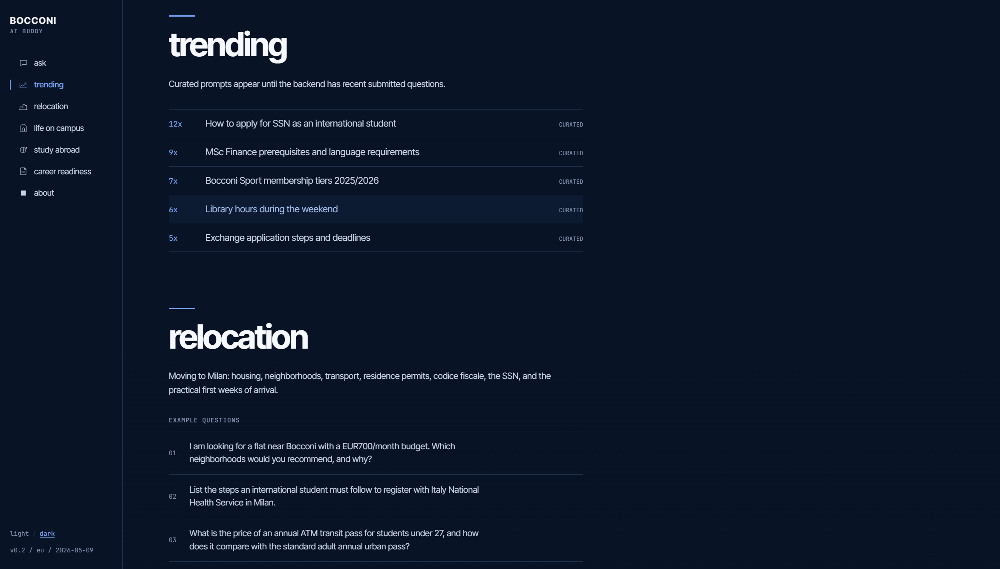
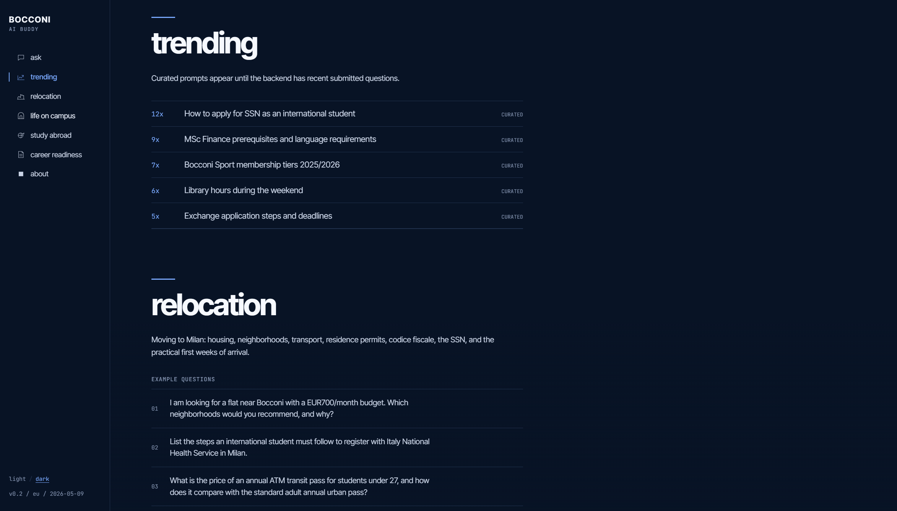
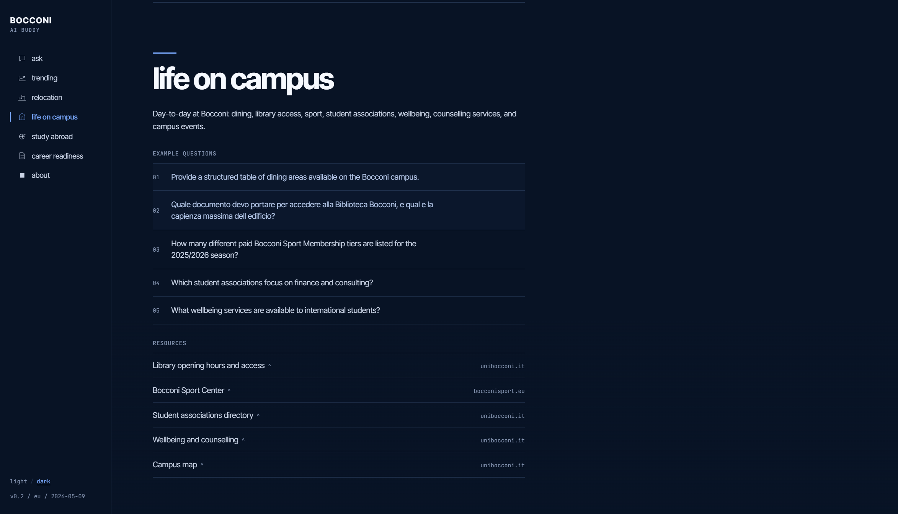

# Bocconi AI Buddy


## General Description

This repository contains my submission for the Bocconi AI Buddy Challenge organized by Yellow Tech and supported by OpenAI. My submission creates an AI Buddy aimed at first-year university students, that features a RAG, multi-turn conversations, example questions across 4 topics, and a "trending" section with currently most asked questions. The technical implementation focuses on a grounded question-answering backend over the provided Bocconi knowledge base, plus a React frontend for asking questions and reviewing sources.

## Screenshots

### Main UI features




### Trending Section



### Example Questions and Resources



## Technical Overview

Bocconi AI Buddy is a two-service web app:

- `backend/`: Python 3.13 FastAPI service exposing the evaluator-facing `POST /ask` endpoint.
- `frontend/`: Vite + React + TypeScript interface for asking questions, displaying source-backed answers, and exploring the four required student-life areas.

The backend answers questions across four fixed verticals:

- `relocation`
- `life_on_campus`
- `study_abroad`
- `career_readiness`

The app uses a retrieval-augmented generation flow over local Markdown data. At request time it retrieves relevant excerpts, optionally rewrites and reranks the retrieval set, generates a grounded answer with OpenAI, and returns source file paths used for the answer.

## Starter vs Submission Work

This project was built on top of a hackathon starter repository. The starter already provided the main service layout, Docker/Railway deployment scaffolding, the large pre-cleaned Bocconi dataset, the frozen `/ask` contract, and an initial backend/frontend implementation.

The submission-specific work in this repository is concentrated around:

- retrieval tuning beyond the starter lexical baseline;
- a prebuilt FAISS vector index in `backend/data/index/`;
- hybrid retrieval using OpenAI embeddings, FAISS, BM25, and reciprocal-rank fusion;
- query rewrite, reranking, secondary retrieval, and evidence checks in `backend/main.py`;
- manual source curation artifacts under `backend/data/manual_collection/`;
- two additional indexed high-value fact files:
  - `backend/data/relocation/atm-urban-travel-pass-fares.md`
  - `backend/data/career_readiness/bocconi-graduate-merit-awards-ay-2026-27.md`
- evaluation scripts and saved test runs under `backend/eval/`;
- a redesigned frontend with vertical sections, local conversation history, recent/trending questions, source display, theme switching, and a floating chat view.

## Architecture

```text
Browser
  |
  | HTTP fetch
  v
Frontend: Vite + React
  |
  | POST /ask
  v
Backend: FastAPI
  |
  | classify vertical
  | rewrite/direct retrieval query
  | vector search + BM25 search
  | reciprocal-rank fusion
  | optional reranking
  | evidence checks + optional secondary retrieval
  | answer generation from selected excerpts
  v
OpenAI API

Local backend data:
  backend/data/
  backend/data/index/faiss.bin
  backend/data/index/metadata.jsonl
  backend/data/index/chunks.jsonl
```

## Backend

Main file: `backend/main.py`

Key endpoints:

| Method | Path | Purpose |
| --- | --- | --- |
| `GET` | `/health` | Health check for local and Railway deploys. |
| `POST` | `/ask` | Main evaluator-facing question-answer endpoint. |
| `GET` | `/recent-questions` | UI helper endpoint for recently submitted questions. |

### `/ask` Contract

Request:

```json
{
  "question": "What is the annual ATM pass price for students under 27?"
}
```

The frontend may also send an optional `history` array for local follow-up context, but `question` is the only required field.

Response:

```json
{
  "answer": "Natural-language answer grounded in the retrieved excerpts.",
  "sources": ["relocation/atm-urban-travel-pass-fares.md"],
  "verticale": "relocation"
}
```

The response shape intentionally stays compatible with the hackathon evaluator: `answer` is a string, `sources` is a list of strings, and `verticale` is one of the four fixed vertical identifiers.

### Retrieval Pipeline

The runtime retrieval flow is implemented directly in `backend/main.py`:

1. Classify the question into one or more preferred verticals using weighted keywords.
2. Build retrieval queries using direct special-case expansions or a short OpenAI rewrite call.
3. Embed the query with `text-embedding-3-large`.
4. Search the prebuilt FAISS index at `backend/data/index/faiss.bin`.
5. Run BM25 lexical search with `rank-bm25`.
6. Merge vector and lexical rankings with reciprocal-rank fusion.
7. Rerank a bounded candidate window with a small OpenAI model when enabled.
8. Run evidence checks for specific names, acronyms, years, prices, and co-occurring terms.
9. Run targeted secondary retrieval if the first pass is thin or missing required evidence.
10. Generate the final answer from selected excerpts only.

The backend logs request diagnostics as JSON, including selected chunks, source paths, timings, model configuration, and whether the answer abstained.

### Runtime Feature Flags

These environment variables can disable parts of the retrieval stack without code changes:

```bash
BUDDY_HYBRID_ENABLED=1
BUDDY_RERANK_ENABLED=1
BUDDY_REWRITE_ENABLED=1
```

Retrieval sizes are also configurable:

```bash
BUDDY_VECTOR_TOP_K=24
BUDDY_HYBRID_TOP_K=24
BUDDY_SECONDARY_TOP_K=24
BUDDY_RERANK_CANDIDATE_K=20
BUDDY_FINAL_SNIPPETS=6
```

## Knowledge Base and Index

The starter dataset lives in `backend/data/` and is organized by vertical:

```text
backend/data/
  relocation/
  life_on_campus/
  study_abroad/
  career_readiness/
  manifest.json
  extra-sources.md
  index/
```

The committed vector index artifacts are:

```text
backend/data/index/chunks.jsonl
backend/data/index/metadata.jsonl
backend/data/index/faiss.bin
```

The index is intentionally built before deployment and shipped with the backend image. The running service should not re-embed the full corpus at startup or on first request.

To rebuild the index:

```bash
cd backend
uv run python scripts/build_index.py
```

This command requires `OPENAI_API_KEY` because it calls the OpenAI embeddings API. For chunk generation without embedding:

```bash
cd backend
uv run python scripts/build_index.py --chunk-only
```

## Frontend

Main files:

```text
frontend/src/App.tsx
frontend/src/api.ts
frontend/src/components/
frontend/src/data/content.ts
frontend/src/index.css
frontend/src/theme.ts
```

Frontend features:

- typed API client for `/ask` and `/recent-questions`;
- main conversation panel with local history passed to the backend;
- vertical sections with example prompts;
- source list display for each answer;
- recent/trending question section;
- floating chat modal opened with `Esc`;
- keyboard shortcut `/` to focus the main question box;
- light/dark theme handling through CSS variables and local storage.

The frontend reads the backend base URL from:

```bash
VITE_BACKEND_URL=http://localhost:8000
```

If the variable is not set, it defaults to `http://localhost:8000`.

## Tech Stack

Backend:

- Python 3.13
- FastAPI
- Pydantic
- OpenAI Python SDK
- FAISS CPU
- NumPy
- rank-bm25
- uv

Frontend:

- Node 22
- React 19
- TypeScript
- Vite
- ESLint

Infrastructure:

- Docker Compose for local development
- Railway-ready backend and frontend service configs
- Separate production builds for backend and frontend

## Environment Variables

Create a local `.env` file from the example:

```bash
cp .env.example .env
```

Required for meaningful answers:

```bash
OPENAI_API_KEY=sk-...
```

Common model and timeout settings:

```bash
OPENAI_MODEL=gpt-5.4
OPENAI_FAST_MODEL=gpt-5.4-mini
OPENAI_FALLBACK_MODEL=gpt-5.4-mini
OPENAI_TIMEOUT_SECONDS=20
FRONTEND_URL=http://localhost:5173
```

Do not commit `.env` or any real API key.

## Local Development

Start both services with Docker Compose:

```bash
docker compose -f docker-compose.dev.yml up -d
```

Local URLs:

- Backend docs: `http://localhost:8000/docs`
- Backend health: `http://localhost:8000/health`
- Frontend: `http://localhost:5173`

Smoke-test `/ask`:

```bash
curl -X POST http://localhost:8000/ask \
  -H 'Content-Type: application/json' \
  -d '{"question":"What is the annual ATM pass price for students under 27?"}'
```

Stop the dev environment:

```bash
docker compose -f docker-compose.dev.yml down
```

## Running Without Docker

Backend:

```bash
cd backend
uv sync
uv run uvicorn main:app --host 0.0.0.0 --port 8000 --reload
```

Frontend:

```bash
cd frontend
npm install
npm run dev
```

## Evaluation and Testing

The repository includes scripts for exercising `/ask` against fixed question sets.

Run the bundled sample questions:

```bash
cd backend
uv run python scripts/run_samples.py --url http://localhost:8000/ask
```

Run a JSONL question set:

```bash
cd backend
uv run python scripts/run_questions.py \
  --questions eval/extended_questions.jsonl \
  --url http://localhost:8000/ask \
  --output eval/results/local-results.jsonl
```

Saved evaluation artifacts are kept under `backend/eval/results/` and `backend/sample-results.*`. These files document the tuning process and regression checks used during the submission.

## Deployment

The project is configured for two Railway services:

- backend service from `backend/`
- frontend service from `frontend/`

Backend deployment uses:

```text
backend/Dockerfile
backend/railway.json
```

Frontend deployment uses:

```text
frontend/railway.json
```

Required production variables:

Backend service:

```bash
OPENAI_API_KEY=sk-...
FRONTEND_URL=https://<frontend-public-url>
```

Frontend service:

```bash
VITE_BACKEND_URL=https://<backend-public-url>
```

The hackathon evaluator calls the backend public URL at `POST /ask`.

## Repository Layout

```text
.
  backend/
    main.py                         # FastAPI app and retrieval pipeline
    scripts/
      build_index.py                # Builds chunks and FAISS index
      run_samples.py                # Runs built-in smoke questions
      run_questions.py              # Runs JSONL eval sets
      scrape_bocconi_public.py      # Manual curation helper
    data/
      index/                        # Committed FAISS/chunk artifacts
      relocation/
      life_on_campus/
      study_abroad/
      career_readiness/
      manual_collection/            # Manual curation notes/artifacts
    eval/                           # Evaluation question sets and results
    Dockerfile
    railway.json
    pyproject.toml
  frontend/
    src/
      components/
      data/
      api.ts
      App.tsx
      index.css
      theme.ts
    package.json
    railway.json
  docker-compose.dev.yml
  Dockerfile.backend
  Dockerfile.frontend
  README_challenge.md               # Original starter README preserved separately
  DEPLOY.md
  DESIGN.md
  AGENTS.md
```

## Notes and Limitations

- The answer quality depends on the local dataset snapshot and the committed index. New source files should be indexed before deployment.
- The backend is designed for single-request answers under the hackathon latency constraint, not long-running agent workflows.
- Conversation memory is local to the browser and sent as optional context; it is not persisted in a database.
- `/recent-questions` is an in-memory UI convenience endpoint and resets when the backend restarts.
- Some evaluation artifacts and submission packaging files are retained for transparency, not required for normal runtime.
